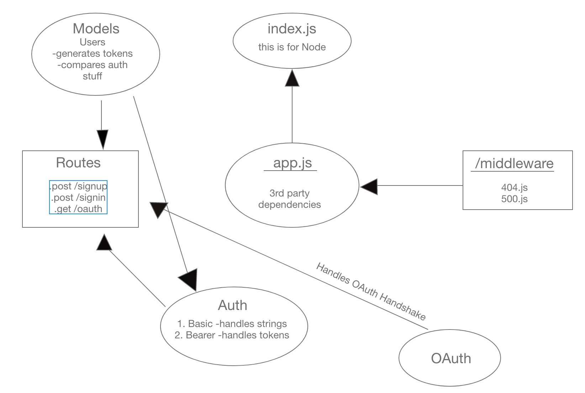

# bearer-auth
JS401 Lab-13

# LAB - 13

## Bearer Auth

### Author: Julie Erlemeier

### Links and Resources
* [submission PR](http://xyz.com)
* [travis](http://xyz.com)
* [back-end](http://xyz.com) (when applicable)
* [front-end](http://xyz.com) (when applicable)

#### Documentation
* [JSON Web TOken](https://jwt.io/introduction/) (JWT)

### Modules
#### `user-model.js`

### Setup
#### `.env` requirements
* `PORT` - Port Number
* `MONGODB_URI` - URL to the running mongo instance/db
* `SECRET`
* `TOKEN_LIFETIME`

#### Running the app
* `npm start`
  
#### Tests
* How do you run tests?
* `npm run test`
* `npm run lint`

#### UML
